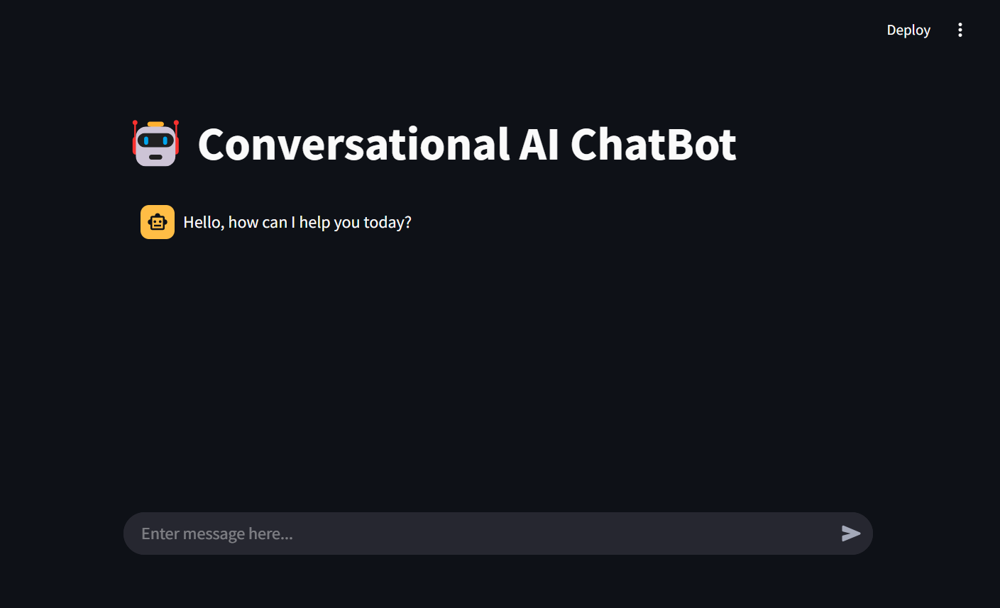
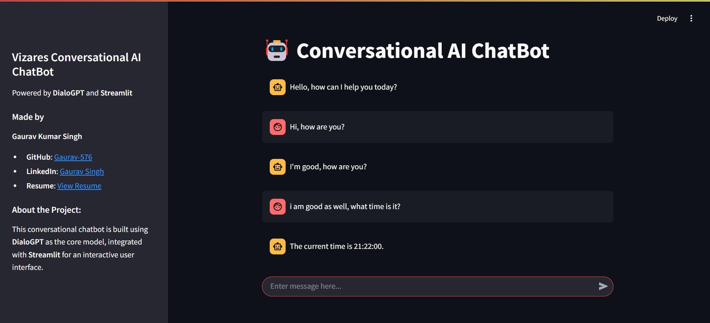
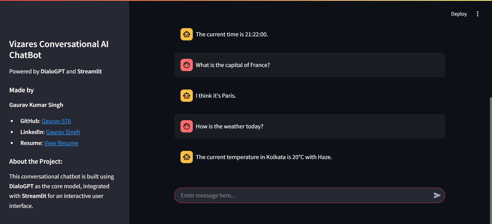

# Conversational Bot

**Conversational Bot** is an AI-driven chatbot application built using **DialoGPT** for generating human-like responses and enhanced with weather and time functionalities. The bot can provide contextual responses based on natural language inputs, deliver weather information, and tell the current time.

---

## 🌐 Explore the Chatbot Live

Check out the live version of the chatbot (Streamlit deployment):  
👉 **[Conversational Bot Live Website](https://link_to_your_live_site)**

Interact with the chatbot for weather updates, time, and natural language conversations!

---

## 🖼️ Conversational Bot in Action

### User Interface
Add a screenshot of the chatbot's user interface:



### Example Interaction
Here is an example of the chatbot in action, displaying an interaction with a user about time:



### Example Interaction
Here is an example of the chatbot in action, displaying an interaction with a user about weather:



---

## 🌟 **Key Features**

1. **AI-Powered Conversational Responses:**
   - Built on **DialoGPT**, a state-of-the-art conversational AI model, providing human-like responses to a wide range of queries.
   - The bot can handle different types of queries, including general conversation, weather updates, and time-related queries.

2. **Weather Information:**
   - Integrates with a **weather API** to provide real-time weather data based on the user’s input (e.g., temperature and weather description for a specific location).
   
3. **Real-Time Time Responses:**
   - Uses the **datetime library** to fetch and return the current time in a user-friendly format.

4. **Natural Language Understanding:**
   - Understands user queries and processes them to generate appropriate responses using **DialoGPT**.

5. **Fallback Mechanism:**
   - In case of unrecognized input, the bot will prompt the user to rephrase or clarify, ensuring a smooth conversational flow.

---

## 🛠️ **Project Structure**

### **File Organization**

```plaintext
Conversational-Bot/
├── app.py                    # Main application file with chatbot logic
├── utility/                  # Helper files for chatbot responses and functionality
│   ├── model.py              # Chatbot model (DialoGPT) and weather/time functionalities
│   └── weather_api.py        # Weather-related API functions
├── requirements.txt          # Python dependencies
├── .env                      # Environment variables for API keys (weather API)
└── README.md                 # Project documentation
```

---

### **Core Components**

- **app.py**:
  - The main file where the chatbot application runs.
  - Handles user input and response generation using the `ChatBot` class from `model.py`.

- **utility/model.py**:
  - Contains the `ChatBot` class that handles the conversation logic, weather and time-related responses.
  - Makes use of **DialoGPT** to generate conversational responses, and integrates with a weather API for real-time weather data.

- **utility/weather_api.py**:
  - Contains functions that interact with the weather API to fetch data and return relevant weather information.

- **.env**:
  - Stores environment variables such as the **Weather API Key** for secure access to the API.

---

## 🚀 **How It Works**

1. **User Input**:
   - The user enters a query into the chatbot interface (e.g., "What's the weather in Kolkata?" or "What's the time?").
   
2. **Weather or Time Detection**:
   - The bot identifies whether the user query relates to weather or time.
   - If the query is related to weather, it calls the `get_weather` function, retrieves the data, and generates a response.
   - If the query is about time, it fetches the current time using Python's `datetime` library.

3. **Conversational Response**:
   - If the input doesn't relate to weather or time, the input is passed through the **DialoGPT** model, which generates a conversational response based on the input.

4. **Natural Language Answer**:
   - The responses are then returned to the user in a human-readable format, whether it's the current time, weather details, or a conversational reply.

---

## 🛠 **Technologies Used**

- **DialoGPT**: A conversational model built by Microsoft and pre-trained on large-scale datasets to generate human-like responses.
- **Streamlit**: Provides an interactive web interface for deploying the chatbot.
- **Datetime**: Python's built-in library used to fetch and format the current time.
- **Weather API**: Used to fetch live weather data from a location provided by the user.

---

## 💻 **Installation and Setup**

1. **Clone the Repository**:
   ```bash
   git clone https://github.com/yourusername/conversational-bot.git
   ```
   Navigate to the folder:
   ```bash
   cd conversational-bot
   ```

2. **Set Up a Virtual Environment**:
   ```bash
   python -m venv venv
   ```
   Activate the Virtual Environment:
   ```bash
   venv\Scripts\activate  # For Linux: source venv/bin/activate
   ```

3. **Install the Dependencies**:
   ```bash
   pip install -r requirements.txt
   ```

4. **Set Up Environment Variables**:
   - Create a `.env` file in the root directory and add your **Weather API Key**:
     ```env
     WEATHER_API_KEY=your_weather_api_key_here
     ```

5. **Run the Application**:
   ```bash
   streamlit run app.py
   ```

6. **Access the Chatbot Locally**:
   - Open your browser and go to [http://localhost:8501](http://localhost:8501) to interact with the chatbot.

---

## 🌐 **Production Deployment**

- Deploy the chatbot using platforms like **Streamlit Cloud** or **Heroku**.
- Ensure that sensitive data (like the **Weather API Key**) is securely managed in production environments, and `.env` files are excluded from deployment.

---

## 📜 **License**

This project is licensed under the [MIT License](LICENSE).

---

## 🤝 **Contributing**

We welcome contributions to improve the bot! Follow these steps to contribute:
1. Fork the repository.
2. Create a new branch (git checkout -b feature-branch).
3. Commit your changes (git commit -m "Added feature").
4. Push to the branch (git push origin feature-branch).
5. Create a pull request.

---

## ✍️ **Creator**

Developed by **[Gaurav Kumar Singh]**  
👔 [LinkedIn](https://www.linkedin.com/in/gaurav-singh-mlops/) | 📦 [GitHub](https://github.com/Gaurav-576) | 🐦 [Twitter](https://twitter.com/Gaurav96753)

---
